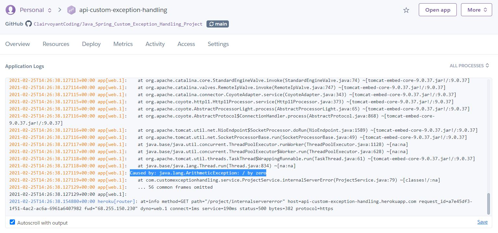

# API Custom Exception Handling Article

Microservices have become a popular choice in designing solution architectures. However, when you work in an environment with many small applications that all depend on each other - it can get very messy. To mitigate this problem, we can create custom exceptions that we throw in place of real exceptions. We can still send the real exception to our application logger so that we have a record of exactly what error caused our problem. We can then provide our own error details in these custom exceptions and use them to populate a generic error response that will be customer-facing. This generic error response class can be shared across all of our applications so that all of our errors are consistent. Since we have consistent errors, creating Unit and Integration tests for all of our applications becomes a breeze since all of our errors are clean and easy to interpret.

## Creating Custom Exceptions

```java
@EqualsAndHashCode(callSuper = true)
@Data
@AllArgsConstructor
public class BadRequestException extends RuntimeException {
    private final String message;
    private final Throwable cause;
}

// And: Unauthorized, Forbidden, Not Found, Conflict, Internal Server Error

@EqualsAndHashCode(callSuper = true)
@Data
@AllArgsConstructor
public class ServiceUnavailableException extends RuntimeException {
    private final String message;
    private final Throwable cause;
}
```

By creating a custom exception for each HTTP Error Response our application may encounter, we can design our errors to be more informative and easier to understand. Notice that each of our custom exception classes extends **RuntimeException**. We extend RuntimeException because we want our custom exceptions to be unchecked exceptions. Since they are unchecked, they do not require us to use the "throws" keyword in our method declaration like we would have to if we instead extended the generic **Exception** class. Now that we have our custom exceptions, we can use them in our services.

## Using Our Customer Exceptions In Our Service

```java
public ProjectDto getProjectById(UUID projectId) {
    try {
        return projectDao.findProjectById(projectId);
    } catch (IllegalArgumentException ex) {
        throw new NotFoundException(Constants.PROJECT_NOT_FOUND, ex);
    }
}
```

Imagine you have a generic **get()** method in your service like the one above. If the entity you're trying to find doesn't exist, you'll get back an **IllegalArgumentException** from your repository since the argument you used to try to find your entity doesn't match any entities. The **IllegalArgumentException** is an ugly error that required you to know exactly how Repositories in the Spring Framework behave to understand. Rather than send that ugly error to the customer, we can instead catch the exception and throw our own custom **NotFoundException** with our own custom message defined in a **Constants** file. Notice that our **NotFoundException** also takes the original exception as a parameter. We'll see why in our next step!

## Logging Our Real Errors & Designing Our Customer Facing Errors

```java
@ControllerAdvice
public class ControllerAdviceExceptionHandler extends ResponseEntityExceptionHandler {
    private final Logger logger;

    public ControllerAdviceExceptionHandler(Logger logger) {
        this.logger = logger;
    }

    @ExceptionHandler(value = { NotFoundException.class })
    protected ResponseEntity<ErrorResponseModel> handleNotFoundException(Exception ex) {
        logger.error(Constants.REST_NOT_FOUND, ex);

        ErrorResponseModel errorDetails = new ErrorResponseModel(
                404,
                dateFormat.format(new Date()),
                Constants.REST_NOT_FOUND,
                ex.getMessage());

        return new ResponseEntity<>(errorDetails, HttpStatus.NOT_FOUND);
    }
}
```

In the package with our custom exceptions we can also create a **ControllerAdvice** class which is a part of the Spring Framework. In this class we can define the responses that our controllers will send when an exception is encountered. In the above example, I've added the handler method for our custom **NotFoundException**. Notice that the first thing we do is log our exception. This log will contain both custom exception and the cause of the custom exception, as seen in the image below:



Even when our custom exception provides a easy to interpret exception message, we'll still be able to look at the actual exception via the logs.

## Generic Error Response Class

```java
@Data
@AllArgsConstructor
@NoArgsConstructor
public class ErrorResponseModel {
    private int statusCode;
    private String date;
    private String restErrorMessage;
    private String detailedErrorMessage;
}
```

Finally, as seen in our exception handler, we will create our own custom error response using the above class.

The above error class contains four fields. The int **statusCode** can be used to store either an HTTP Error Response code, or a custom error code from an internal error document your QA team maintains. The String **date** can be used to get the exact time the error occurred. I use a String type rather than a Date or Timestamp type because the string allows me to format how my date displays into "yyyy-MM-dd HH:mm:ss.SSSSSS". The String **restErrorMessage** is to display the type of Http Error Response that occurred such as: Bad Request, Unauthorized, and so on. Lastly, the String **detailedErrorMessage** displays the specific error message that caused the problem. This could include: "User already exists", "Required field not provided", "The application is experiencing an issue. Please try again later".


Here is an example of the response we get from the custom Internal Server Error Exception we threw above. 

## Seeing The Result In Action

You can see all of this in action and check out the other types of exceptions by going to: https://api-custom-exception-handling.herokuapp.com/

You will not be able to access the project logs but the pictures I've included here should suffice.

## Unit Testing

In our unit tests our goal is to test as much of our business logic as possible in a metric called **Code Coverage** that is expressed as a percentage. We test each service and controller in the project and write a test for each unique way our code could fail or succeed. Since we're testing each controller and service individually, we need to account for the dependencies of each of these controllers and services. We do this by mocking each of the dependencies our controllers and services need to run.

For example, the **ProjectService** depends on the **ProjectDAO** in order to perform its job. As you can see in the test below, we create a projectDAO and set it equal to the result of our org.mockito.Mockito.mock function call. Then, when we create our projectService instance we inject the mock. 

**We do not call the "real" methods of our mocked dependencies**. We instead force our dependencies to return what we want using a **Mockito when()** statement. In our first test, we say that whenever the *projectDAO.getProject()* method is invoked with the argument **true**, the result will be a String SUCCESS message. After our whenever statement, we call the projectService.succeed() method, which will call the *projectDAO.getProject()* method with a value of true, which our mocking will force that function to return "Constants.Success". The actual *projectDAO.getProject()* is never called since we mocked it - so if you put a breakpoint in that method it would never be hit. 

We can force successful returns and we can also force exceptions to be thrown from our dependency calls using mocking. In our second test case we force the same *projectDAO.getProject()* to throw a BadRequestException. Then when it's called, it will force that to happen. This allows us to test that the projectService will behave in the correct way when it encounters this kind of exception.

After we get a response from the method we are testing, we can use a Mockito **verify()** statement to verify that our method was called the correct number of times. Especially if we configure retry logic, the verify method will be very importent in ensuring our code is behavign how we expect.

After our verifys, we then assert that the values we got in our response are correct.

```java
@ExtendWith(MockitoExtension.class)
public class ProjectServiceUnitTests {
    private final ProjectDAO projectDAO = mock(ProjectDAO.class);

    private final ProjectService projectService = new ProjectService(projectDAO);

    @Test
    void success_validInput_200Okay() {
        when(projectDAO.getProject(true))
                .thenReturn(Constants.SUCCESS);

        String response = projectService.succeed();
        
        verify(projectDAO).getProject(true);

        assertNotNull(response);
        assertEquals(Constants.SUCCESS, response);
    }

    @Test
    void success_invalidInput_400BadRequest() {
        BadRequestException ex = new BadRequestException(Constants.REST_BAD_REQUEST, null);

        when(projectDAO.getProject(true)).thenThrow(ex);

        BadRequestException response = assertThrows(BadRequestException.class, projectService::succeed);

        verify(projectDAO).getProject(true);

        assertNotNull(response);
        assertEquals(Constants.REST_BAD_REQUEST, response.getMessage());
    }
}
```

## Integration Testing

The last topic I'll cover is integration testing. Integration testing does not use mocking at all. It will actually spin up the app on your local machine, and test your endpoints with real data and then validate that the correct response comes back in each case. We can use the *TestRestTemplate* class as our HTTP Client, and an ObjectMapper class to map the ResponseEntity we receive back from our endpoints into a DTO. 

We can call the *testRestTemplate.exchange()* method with the path to the endpoint we want to hit, the HttpMethod we are calling with, the request body, and the expected response class. The success() endpoint only returns a single string, so we don't need to map the response into a class. The BadRequest test returns an ErrorResponseModel that we can map our response to with the ObjectMapper.

Then we validate that the responses are what we want in the last step of our test. 

```java
@SpringBootTest(webEnvironment = SpringBootTest.WebEnvironment.RANDOM_PORT)
@ActiveProfiles(resolver = SpringCommandLineProfileResolver.class)
public class ProjectControllerIntegrationTests {
    @Autowired
    TestRestTemplate testRestTemplate;

    private final ObjectMapper objectMapper = new ObjectMapper();

    @Test
    void successEndpoint_validInput_200Success() {
        ResponseEntity<String> response = testRestTemplate.exchange("/project/success", HttpMethod.GET, null, String.class);

        assertNotNull(response.getBody());
        assertEquals(Constants.SUCCESS, response.getBody());
    }

    @Test
    void badRequestEndpoint_validInput_400BadRequest() throws JsonProcessingException {
        ResponseEntity<String> response = testRestTemplate.exchange("/project/badrequest", HttpMethod.GET, null, String.class);
        ErrorResponseModel errorResponse = this.objectMapper.readValue(response.getBody(), ErrorResponseModel.class);
        String expectedDetailedErrorMsg = Constants.PROJECT_MUST_HAVE_NAME + Constants.PROJECT_MUST_HAVE_DESCRIPTION + Constants.PROJECT_MUST_HAVE_START_DATE;

        assertNotNull(response);
        assertNotNull(errorResponse.getDate());
        assertEquals(Constants.REST_BAD_REQUEST, errorResponse.getRestErrorMessage());
        assertEquals(expectedDetailedErrorMsg, errorResponse.getDetailedErrorMessage());
    }
```

## Testing Conventions

### Tests Document Business Rules

Each test exists as a living document of a business rule. Example business rule: When you try to get a project that does not exist, return a "Not Found" error to the user. In addition to documenting the business rules, the test exists to ensure that new work does not break old code. If we create a new feature that we didn't anticipate would impact an existing feature, our test breaking will be what saves us from pushing broken code to prod. 

### Test Naming Convention

In order to make our tests as easy to understand, we can name them using the convention: **{method being tested}_{description of input}_{description of result}**. For example: **registerUser_validUserInput_201Created**. Without reading any code within this function, we can immediately understand what function is being tested, what input is provided, and the expected result.

> NOTE: I used "registerUser" to define the function being tested without providing if it is the controller, the service, or the dao that is being tested. This is okay because we create unique testing classes for each controller and service, so you would know what class the function belongs to based on the file you're in. 

### Triple "A" Test Structure

Tests can get very messy if you have more than one dependency, or complex input to your test, or tons of setup to do so that your test will work. That's why it's important that we follow a convention for structuring tests. The most popular one I have used is **Triple A**. Triple "A" stands for: 

- Assemble
- Act
- Assert

The idea is that each of our tests should have three sections. The first is the **Assemble** section where we create our input data and setup our mocking **when()** statements and any response or error objects we want our test to return or throw. The second section is our **Act** section where we actually call the method we are going to be testing and save the result. Lastly, in our **Assert** section we validate that the respone we got is the correct one. Following this pattern will keep our tests clean. Example:

```java
    @Test
    void success_invalidInput_400BadRequest() {
        // assemble
        BadRequestException ex = new BadRequestException(Constants.REST_BAD_REQUEST, null);
        when(projectDAO.getProject(true)).thenThrow(ex);
    
        // act
        BadRequestException response = assertThrows(BadRequestException.class, projectService::succeed);

        // assert
        verify(projectDAO).getProject(true);

        assertNotNull(response);
        assertEquals(Constants.REST_BAD_REQUEST, response.getMessage());
    }
```

***

In this article I cover:

- Creating custom application exceptions to be thrown in place of any exception you would not want a user to see
- Utilizing logging to persist the ugly error messages you wouldn't want users to see
- Using Controller Advice on a Spring Controller to catch the errors thrown by incoming requests
- Effective utilization of a global constant file
- Unit testing using juniper
- Integration testing

In this project I'll use Java 11, but this code should run in Java 8 with very little modification. It could also be ported over to Kotlin fairly easily as well.
