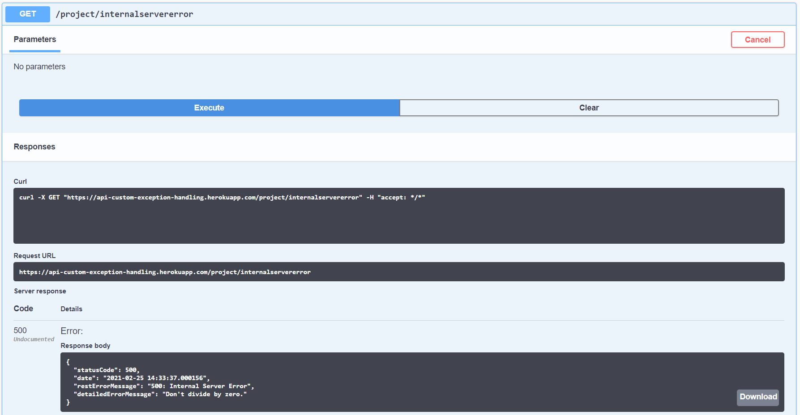

# API Custom Exception Handling Article

Microservices have become a popular choice in designing solution architectures. However, when you work in an environment with many small applications that all depend on each other - it can get very messy. To mitigate this problem, we can create custom exceptions that we throw in place of real exceptions. We can still send the real exception to our application logger so that we have a record of exactly what error caused our problem. We can then provide our own error details in these custom exceptions and use them to populate a generic error response that will be customer-facing. This generic error response class can be shared across all of our applications so that all of our errors are consistent. Since we have consistent errors, creating Unit and Integration tests for all of our applications becomes a breeze since all of our errors are clean and easy to interpret.

## Creating Custom Exceptions

```java
@EqualsAndHashCode(callSuper = true)
@Data
@AllArgsConstructor
public class BadRequestException extends RuntimeException {
    private final String message;
    private final Throwable cause;
}

// And: Unauthorized, Forbidden, Not Found, Conflict, Internal Server Error

@EqualsAndHashCode(callSuper = true)
@Data
@AllArgsConstructor
public class ServiceUnavailableException extends RuntimeException {
    private final String message;
    private final Throwable cause;
}
```

By creating a custom exception for each HTTP Error Response our application may encounter, we can design our errors to be more informative and easier to understand. Notice that each of our custom exception classes extends **RuntimeException**. We extend RuntimeException because we want our custom exceptions to be unchecked exceptions. Since they are unchecked, they do not require us to use the "throws" keyword in our method declaration like we would have to if we instead extended the generic **Exception** class. Now that we have our custom exceptions, we can use them in our services.

## Using Our Customer Exceptions In Our Service

```java
public ProjectDto getProjectById(UUID projectId) {
    try {
        return projectDao.findProjectById(projectId);
    } catch (IllegalArgumentException ex) {
        throw new NotFoundException(Constants.PROJECT_NOT_FOUND, ex);
    }
}
```

Imagine you have a generic **get()** method in your service like the one above. If the entity you're trying to find doesn't exist, you'll get back an **IllegalArgumentException** from your repository since the argument you used to try to find your entity doesn't match any entities. The **IllegalArgumentException** is an ugly error that required you to know exactly how Repositories in the Spring Framework behave to understand. Rather than send that ugly error to the customer, we can instead catch the exception and throw our own custom **NotFoundException** with our own custom message defined in a **Constants** file. Notice that our **NotFoundException** also takes the original exception as a parameter. We'll see why in our next step!

## Logging Our Real Errors & Designing Our Customer Facing Errors

```java
@ControllerAdvice
public class ControllerAdviceExceptionHandler extends ResponseEntityExceptionHandler {
    private final Logger logger;

    public ControllerAdviceExceptionHandler(Logger logger) {
        this.logger = logger;
    }

    @ExceptionHandler(value = { NotFoundException.class })
    protected ResponseEntity<ErrorResponseModel> handleNotFoundException(Exception ex) {
        logger.error(Constants.REST_NOT_FOUND, ex);

        ErrorResponseModel errorDetails = new ErrorResponseModel(
                404,
                dateFormat.format(new Date()),
                Constants.REST_NOT_FOUND,
                ex.getMessage());

        return new ResponseEntity<>(errorDetails, HttpStatus.NOT_FOUND);
    }
}
```

In the package with our custom exceptions we can also create a **ControllerAdvice** class which is a part of the Spring Framework. In this class we can define the responses that our controllers will send when an exception is encountered. In the above example, I've added the handler method for our custom **NotFoundException**. Notice that the first thing we do is log our exception. This log will contain both custom exception and the cause of the custom exception, as seen in the image below:


Even when our custom exception provides a easy to interpret exception message, we'll still be able to look at the actual exception via the logs.

## Generic Error Response Class

```java
@Data
@AllArgsConstructor
@NoArgsConstructor
public class ErrorResponseModel {
    private int statusCode;
    private String date;
    private String restErrorMessage;
    private String detailedErrorMessage;
}
```

Finally, as seen in our exception handler, we will create our own custom error response using the above class.

The above error class contains four fields. The int **statusCode** can be used to store either an HTTP Error Response code, or a custom error code from an internal error document your QA team maintains. The String **date** can be used to get the exact time the error occurred. I use a String type rather than a Date or Timestamp type because the string allows me to format how my date displays into "yyyy-MM-dd HH:mm:ss.SSSSSS". The String **restErrorMessage** is to display the type of Http Error Response that occurred such as: Bad Request, Unauthorized, and so on. Lastly, the String **detailedErrorMessage** displays the specific error message that caused the problem. This could include: "User already exists", "Required field not provided", "The application is experiencing an issue. Please try again later".



Here is an example of the response we get from the custom Internal Server Error Exception we threw above. 

## Seeing The Result In Action

You can see all of this in action and check out the other types of exceptions by going to: https://api-custom-exception-handling.herokuapp.com/

You will not be able to access the project logs but the pictures I've included here should suffice.

## Facilitating Our Unit & Integration Testing


***

In this article I cover:

- Creating custom application exceptions to be thrown in place of any exception you would not want a user to see
- Utilizing logging to persist the ugly error messages you wouldn't want users to see
- Using Controller Advice on a Spring Controller to catch the errors thrown by incoming requests
- Effective utilization of a global constant file

In this project I'll use Java 11, but this code should run in Java 8 with very little modification. It could also be ported over to Kotlin fairly easily as well.
